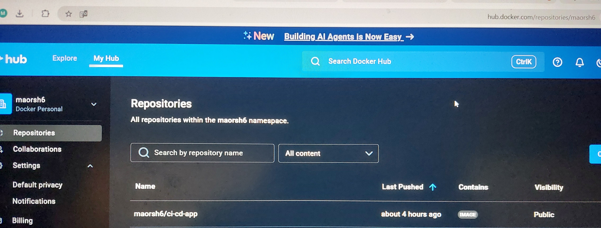
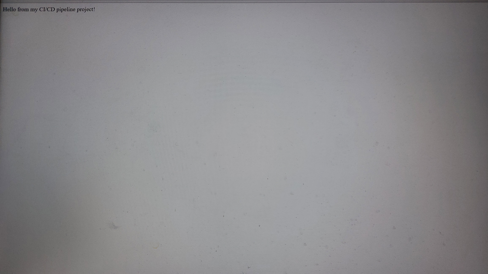

# CI/CD Node.js Application Pipeline

This project demonstrates a complete **CI/CD pipeline** for a Node.js application using **Jenkins**, **Docker**, and **Kubernetes (Minikube)**. The goal is to showcase end-to-end automation from code commit to deployment on a local Kubernetes cluster.

---

## **Project Overview**

The pipeline automates the following workflow:

1. **Code Checkout**: Pulls the latest code from GitHub.  
2. **Docker Image Build**: Builds a Docker image of the Node.js application.  
3. **Push to Docker Hub**: Publishes the Docker image to Docker Hub (`maorsh6/ci-cd-app`).  
4. **Deploy to Minikube**: Deploys the application using Kubernetes manifests (`deployment.yaml` and `service.yaml`).  

This pipeline allows you to automatically deploy updates whenever new code is pushed, simulating a real-world DevOps workflow.

---

## **Technologies Used**

- **Jenkins** – Automates CI/CD pipelines.  
- **Docker** – Containerizes the application.  
- **Kubernetes (Minikube)** – Local cluster deployment for testing.  
- **Node.js** – Backend runtime for the application.  
- **GitHub** – Source control and version management.  

---

## **Project Structure**

ci-cd-app/
├── Jenkinsfile # CI/CD pipeline definition
├── Dockerfile # Defines the Docker image
├── package.json # Node.js dependencies
├── package-lock.json
├── k8s/ # Kubernetes manifests
│ ├── deployment.yaml
│ └── service.yaml
└── src/ # Application source code
└── index.js

---

## **Pipeline Stages**

### **1. Checkout**
- Pulls the latest code from the `main` branch on GitHub.  
- Ensures Jenkins is always working with the latest commit.

### **2. Build Docker Image**
- Builds a Docker image using the `Dockerfile`.  
- Image tagged as `maorsh6/ci-cd-app:latest`.

### **3. Push to DockerHub**
- Logs in to Docker Hub using Jenkins credentials.  
- Pushes the built image to Docker Hub repository `maorsh6/ci-cd-app`.

### **4. Deploy to Minikube**
- Sets the `KUBECONFIG` to point to the local Minikube cluster.  
- Applies Kubernetes manifests:
  - `deployment.yaml` – Defines the deployment and container replicas.  
  - `service.yaml` – Exposes the application via a ClusterIP or NodePort service.  

---

## **Getting Started**

### **Prerequisites**
- Jenkins installed on Windows.  
- Docker installed and running.  
- Minikube installed and configured.  
- Docker Hub account (`maorsh6`).  
- Git installed.

### **Setup Steps**
1. Clone the repository:
```bash
git clone https://github.com/maorsh1/devops-portfolio.git
Open Jenkins, create a new pipeline, and point it to this repository.

Run the pipeline:

Docker image will be built and pushed.

Kubernetes manifests will be applied to Minikube.

Verify deployment:
kubectl get pods
kubectl get services

Author
Maor Shimshilashvili
DevOps Engineer | CI/CD & Kubernetes Enthusiast | Node.js Developer

Notes

The pipeline is fully automated and designed to run on Windows + Jenkins + Minikube.

Docker image is lightweight, based on Node.js 18 official image.

Can be extended to include additional stages like unit testing, SonarQube analysis, or deployment to a cloud cluster.


## Project Screenshots

Below are some screenshots taken during the final stages of the project:

### Jenkins Pipeline Execution


### Docker Hub Image Published


### Docker Hub Image Published


### Running Application (Port 3000)


